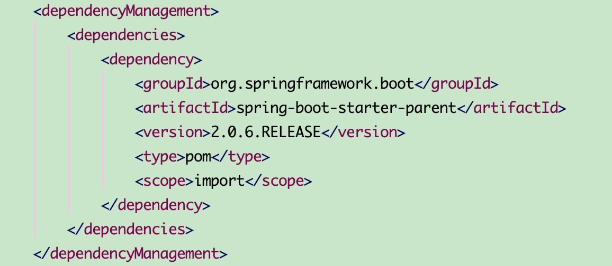
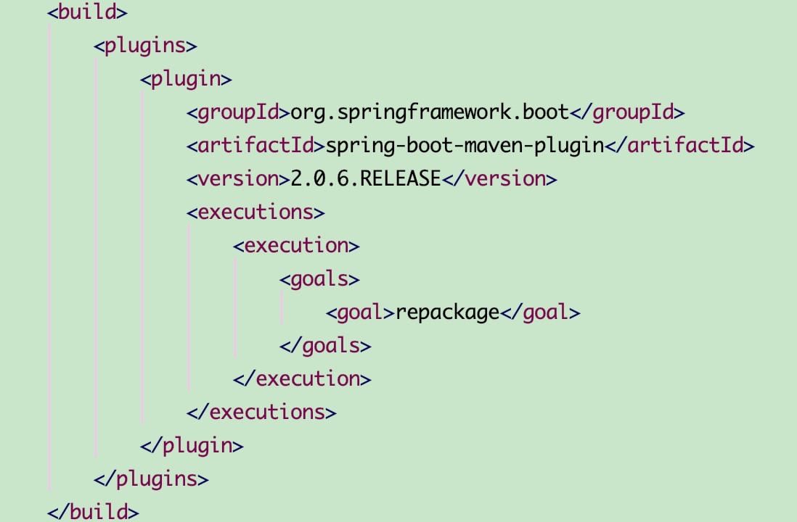

# 不使用`spring-boot-starter-parent`作为依赖`parent`

## 背景环境
在某些情况下由于某些原因，我们的项目不能使用`spring-boot-starter-parent`作为`<parent>`依赖，一定要有自己的`<parent>`，但同时还希望有Springboot自动配置等特性。

## 实现方案



1. 在`pom.xml`文件中添加`<dependencyManagement>`标签，引入`spring-boot-starter-parent`。这个时候在`<dependencies>`标签里添加的依赖依然享有Springboot自动配置等特性。



2. 指定在`spring-boot-maven-plugin`打包在`repackage`阶段介入进来


### 代码

```
<?xml version="1.0" encoding="UTF-8"?>
<project xmlns="http://maven.apache.org/POM/4.0.0" xmlns:xsi="http://www.w3.org/2001/XMLSchema-instance"
         xsi:schemaLocation="http://maven.apache.org/POM/4.0.0 https://maven.apache.org/xsd/maven-4.0.0.xsd">
    <modelVersion>4.0.0</modelVersion>

    <groupId>com.lucky</groupId>
    <artifactId>01spring-nonuse-springbootparent</artifactId>
    <version>0.0.1-SNAPSHOT</version>
    <name>01spring-nonuse-springbootparent</name>

    <properties>
        <java.version>1.8</java.version>
    </properties>

    <dependencies>
        <dependency>
            <groupId>org.springframework.boot</groupId>
            <artifactId>spring-boot-starter</artifactId>
        </dependency>
        <dependency>
            <groupId>org.springframework.boot</groupId>
            <artifactId>spring-boot-starter-web</artifactId>
        </dependency>

        <dependency>
            <groupId>org.springframework.boot</groupId>
            <artifactId>spring-boot-starter-test</artifactId>
            <scope>test</scope>
        </dependency>
    </dependencies>

    <dependencyManagement>
        <dependencies>
            <dependency>
                <groupId>org.springframework.boot</groupId>
                <artifactId>spring-boot-starter-parent</artifactId>
                <version>2.0.6.RELEASE</version>
                <type>pom</type>
                <scope>import</scope>
            </dependency>
        </dependencies>
    </dependencyManagement>

    <build>
        <plugins>
            <plugin>
                <groupId>org.springframework.boot</groupId>
                <artifactId>spring-boot-maven-plugin</artifactId>
                <version>2.0.6.RELEASE</version>
                <executions>
                    <execution>
                        <goals>
                            <goal>repackage</goal>
                        </goals>
                    </execution>
                </executions>
            </plugin>
        </plugins>
    </build>

</project>

```
